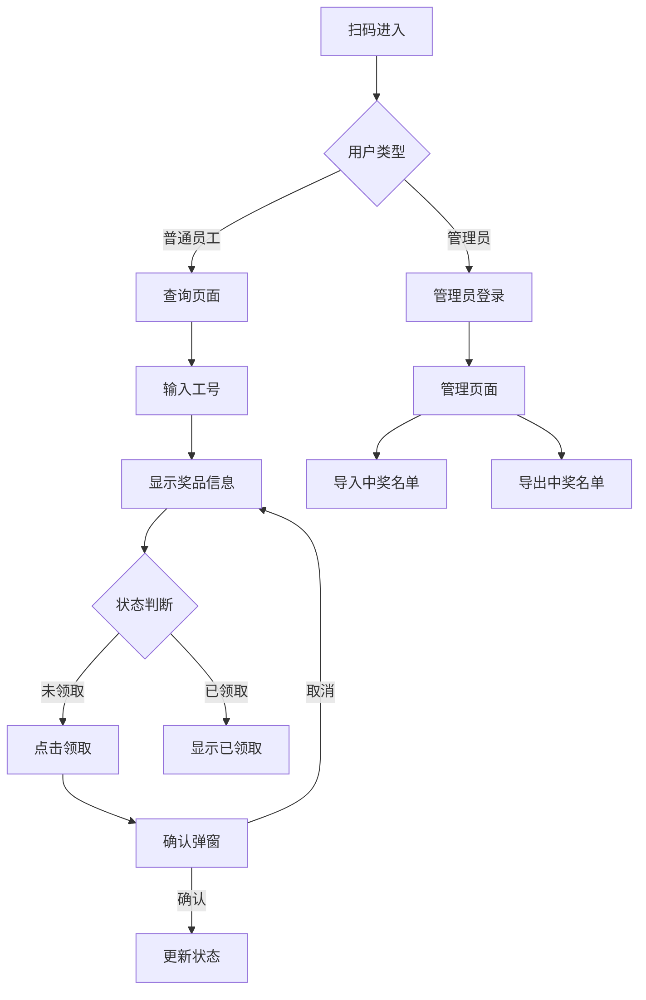

## 1. 产品概述
一个简单的中奖名单兑换移动网页应用，支持用户通过工号查询和领取奖品，管理员导入导出中奖名单。主要解决企业年会或活动中奖品兑换的管理问题，让员工能够便捷地领取奖品，管理员能够高效管理中奖名单。

## 2. 核心功能

### 2.1 用户角色
| 角色 | 注册方式 | 核心权限 |
|------|----------|----------|
| 普通用户 | 无需注册，直接输入工号 | 查询个人奖品、领取奖品 |
| 管理员 | 通过特定管理员工号登录 | 导入中奖名单、导出更新后的中奖名单 |

### 2.2 功能模块
中奖名单兑换项目包含以下主要页面：
1. **查询页面**：工号输入框、奖品信息展示、领取按钮
2. **确认页面**：领取确认弹窗
3. **管理页面**：文件上传、导入导出按钮

### 2.3 页面详情
| 页面名称 | 模块名称 | 功能描述 |
|----------|----------|----------|
| 查询页面 | 工号输入 | 输入工号，点击查询按钮 |
| 查询页面 | 奖品展示 | 显示员工姓名、奖品名称、状态 |
| 查询页面 | 领取操作 | 显示领取按钮（未领取状态），点击后跳转到确认页面 |
| 确认页面 | 领取确认 | 显示确认领取弹窗，包含确认和取消按钮 |
| 管理页面 | 管理员登录 | 输入特定管理员工号进入管理界面 |
| 管理页面 | 文件上传 | 上传Excel格式的中奖名单文件 |
| 管理页面 | 导入功能 | 将Excel数据导入到数据库 |
| 管理页面 | 导出功能 | 导出当前数据库中的中奖名单（包含最新状态） |

## 3. 核心流程

### 普通用户流程
用户扫描二维码进入查询页面，输入工号查询奖品信息，如果奖品未领取则点击领取按钮，在确认弹窗中确认领取，系统更新奖品状态为已领取。

### 管理员流程
管理员扫描二维码进入登录页面，输入特定管理员工号登录管理界面，可以上传Excel文件导入中奖名单，或导出包含最新状态的中奖名单。

## 4. 用户界面设计

### 4.1 设计风格
- **主色调**：蓝色系（#1890ff）为主，白色背景
- **按钮样式**：圆角矩形，蓝色背景，白色文字
- **字体**：系统默认字体，主要文字16px，标题20px
- **布局风格**：卡片式布局，居中显示，上下结构
- **图标风格**：使用简洁的线性图标

### 4.2 页面设计概览
| 页面名称 | 模块名称 | UI元素 |
|----------|----------|----------|
| 查询页面 | 工号输入 | 顶部标题、居中输入框、蓝色查询按钮、输入框下方显示查询结果卡片 |
| 查询页面 | 奖品展示 | 卡片显示员工姓名、奖品名称、状态标签（未领取为橙色，已领取为绿色） |
| 查询页面 | 领取操作 | 蓝色领取按钮，居中显示在结果卡片下方 |
| 确认页面 | 领取确认 | 半透明遮罩层，白色确认卡片，包含提示文字和确认/取消按钮 |
| 管理页面 | 文件上传 | 文件选择按钮、上传进度条、导入按钮 |
| 管理页面 | 导出功能 | 蓝色导出按钮，显示当前数据条数 |

### 4.3 响应式设计
采用移动优先设计，主要适配手机屏幕（375px-414px宽度），确保在各种手机设备上都能正常显示和操作。所有交互元素适合触摸操作，按钮大小不小于44px。

## 5. 数据需求
基于Excel文件格式，数据包含以下字段：
- 工号（唯一标识）
- 姓名
- 奖品名称
- 状态（未领取/已领取）
- 领取时间