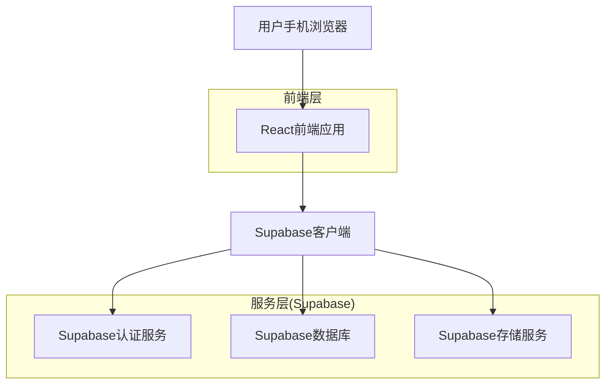
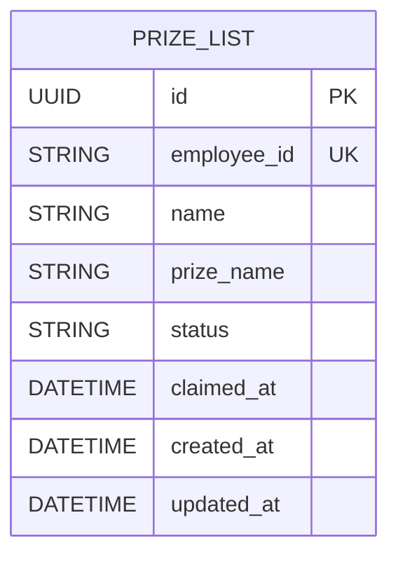

## 1. 架构设计



## 2. 技术描述

- **前端**: React@18 + Vite + TailwindCSS
- **初始化工具**: vite-init
- **后端**: 无独立后端，使用Supabase作为BaaS
- **数据库**: Supabase (PostgreSQL)
- **部署**: Vercel
- **核心依赖**: 
  - @supabase/supabase-js (Supabase客户端)
  - react-router-dom (路由管理)
  - xlsx (Excel文件处理)
  - lucide-react (图标库)

## 3. 路由定义

| 路由 | 用途 |
|-------|---------|
| / | 查询页面，员工输入工号查询奖品 |
| /confirm | 确认页面，确认领取奖品 |
| /admin | 管理员登录页面 |
| /admin/dashboard | 管理员控制台，导入导出功能 |

## 4. API定义

### 4.1 Supabase数据库操作

**查询员工奖品信息**
```javascript
// 查询员工信息
const { data, error } = await supabase
  .from('prize_list')
  .select('*')
  .eq('employee_id', employeeId)
  .single()
```

**更新奖品状态**
```javascript
// 更新为已领取状态
const { data, error } = await supabase
  .from('prize_list')
  .update({ 
    status: '已领取',
    claimed_at: new Date().toISOString()
  })
  .eq('employee_id', employeeId)
```

**批量导入数据**
```javascript
// 批量插入数据
const { data, error } = await supabase
  .from('prize_list')
  .insert(prizeDataList)
```

**导出所有数据**
```javascript
// 查询所有数据
const { data, error } = await supabase
  .from('prize_list')
  .select('*')
  .order('employee_id', { ascending: true })
```

## 5. 数据模型

### 5.1 数据模型定义



### 5.2 数据定义语言

**中奖名单表 (prize_list)**
```sql
-- 创建表
CREATE TABLE prize_list (
    id UUID PRIMARY KEY DEFAULT gen_random_uuid(),
    employee_id VARCHAR(50) UNIQUE NOT NULL,
    name VARCHAR(100) NOT NULL,
    prize_name VARCHAR(200) NOT NULL,
    status VARCHAR(20) DEFAULT '未领取' CHECK (status IN ('未领取', '已领取')),
    claimed_at TIMESTAMP WITH TIME ZONE,
    created_at TIMESTAMP WITH TIME ZONE DEFAULT NOW(),
    updated_at TIMESTAMP WITH TIME ZONE DEFAULT NOW()
);

-- 创建索引
CREATE INDEX idx_prize_list_employee_id ON prize_list(employee_id);
CREATE INDEX idx_prize_list_status ON prize_list(status);

-- 权限设置
GRANT SELECT ON prize_list TO anon;
GRANT ALL PRIVILEGES ON prize_list TO authenticated;

-- RLS策略
ALTER TABLE prize_list ENABLE ROW LEVEL SECURITY;

-- 匿名用户只能查询
CREATE POLICY "Allow anonymous read access" ON prize_list
    FOR SELECT USING (true);

-- 认证用户可以更新
CREATE POLICY "Allow authenticated update access" ON prize_list
    FOR UPDATE USING (auth.role() = 'authenticated');

-- 认证用户可以插入
CREATE POLICY "Allow authenticated insert access" ON prize_list
    FOR INSERT WITH CHECK (auth.role() = 'authenticated');
```

## 6. Excel文件格式

**导入文件格式要求**
- 文件类型：.xlsx
- 列顺序：工号 | 姓名 | 奖品名称
- 第一行为表头（会被跳过）
- 示例格式：
```
工号    | 姓名    | 奖品名称
A001   | 张三    | 一等奖
A002   | 李四    | 二等奖
```

**导出文件格式**
- 包含字段：工号、姓名、奖品名称、状态、领取时间
- 文件命名：中奖名单_导出时间.xlsx

## 7. 部署配置

**Vercel配置 (vercel.json)**
```json
{
  "builds": [
    {
      "src": "package.json",
      "use": "@vercel/static-build",
      "config": {
        "distDir": "dist"
      }
    }
  ],
  "routes": [
    {
      "src": "/(.*)",
      "dest": "/index.html"
    }
  ]
}
```

**环境变量配置**
- VITE_SUPABASE_URL: Supabase项目URL
- VITE_SUPABASE_ANON_KEY: Supabase匿名密钥
- VITE_ADMIN_EMPLOYEE_ID: 特定管理员工号